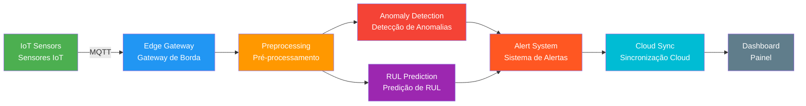

<div align="center">

# IoT Predictive Maintenance Edge

### Sistema de Manuten&ccedil;&atilde;o Preditiva IoT com Edge Computing

[](https://www.python.org/downloads/)
[](https://scikit-learn.org/)
[](LICENSE)
[](Dockerfile)
[](#)

*An edge computing platform for real-time predictive maintenance of industrial equipment, combining IoT sensor data with machine learning for anomaly detection and remaining useful life prediction.*

*Uma plataforma de edge computing para manuten&ccedil;&atilde;o preditiva em tempo real de equipamentos industriais, combinando dados de sensores IoT com aprendizado de m&aacute;quina para detec&ccedil;&atilde;o de anomalias e predi&ccedil;&atilde;o de vida &uacute;til remanescente.*

</div>

---

## Architecture / Arquitetura



---

## Table of Contents / Sumario

- [About / Sobre](#about--sobre)
- [Features / Funcionalidades](#features--funcionalidades)
- [Project Structure / Estrutura](#project-structure--estrutura-do-projeto)
- [Getting Started / Como Comecar](#getting-started--como-comecar)
- [Demo Output / Saida da Demo](#demo-output--saida-da-demo)
- [Industry Applications / Aplicacoes Industriais](#industry-applications--aplicacoes-industriais)
- [Tech Stack](#tech-stack)

---

## About / Sobre

**English:**

This project implements a complete edge computing system for IoT predictive maintenance. It simulates an industrial environment where machines are continuously monitored through multiple sensors (vibration, temperature, pressure, current, and acoustic emission). The system processes sensor data on edge devices, runs machine learning models for anomaly detection and remaining useful life (RUL) estimation, and generates real-time alerts when equipment shows signs of degradation.

The edge-first approach ensures low-latency decisions close to the equipment, with periodic cloud synchronization for centralized monitoring and model updates. This architecture is well-suited for environments where network connectivity may be intermittent or where real-time response is critical.

**Portugues:**

Este projeto implementa um sistema completo de edge computing para manuten&ccedil;&atilde;o preditiva IoT. Ele simula um ambiente industrial onde m&aacute;quinas s&atilde;o monitoradas continuamente atrav&eacute;s de m&uacute;ltiplos sensores (vibra&ccedil;&atilde;o, temperatura, press&atilde;o, corrente e emiss&atilde;o ac&uacute;stica). O sistema processa dados dos sensores em dispositivos de borda, executa modelos de aprendizado de m&aacute;quina para detec&ccedil;&atilde;o de anomalias e estima&ccedil;&atilde;o de vida &uacute;til remanescente (RUL), e gera alertas em tempo real quando os equipamentos demonstram sinais de degrada&ccedil;&atilde;o.

A abordagem edge-first garante decis&otilde;es de baixa lat&ecirc;ncia pr&oacute;ximas ao equipamento, com sincroniza&ccedil;&atilde;o peri&oacute;dica em nuvem para monitoramento centralizado e atualiza&ccedil;&atilde;o de modelos. Essa arquitetura &eacute; ideal para ambientes onde a conectividade de rede pode ser intermitente ou onde a resposta em tempo real &eacute; cr&iacute;tica.

---

## Features / Funcionalidades

| Feature | Description / Descri&ccedil;&atilde;o |
|---------|-------------|
| **Sensor Data Ingestion** | Simulates 5 types of industrial sensors with realistic data profiles for normal, degrading, and failure modes. / Simula 5 tipos de sensores industriais com perfis real&iacute;sticos para modos normal, degradando e falha. |
| **Signal Preprocessing** | Moving average noise removal, z-score and min-max normalization, IQR outlier detection. / Remo&ccedil;&atilde;o de ru&iacute;do com m&eacute;dia m&oacute;vel, normaliza&ccedil;&atilde;o z-score e min-max, detec&ccedil;&atilde;o de outliers IQR. |
| **Anomaly Detection** | Hybrid approach combining Isolation Forest with statistical z-score thresholds. / Abordagem h&iacute;brida combinando Isolation Forest com limiares estat&iacute;sticos z-score. |
| **RUL Prediction** | Gradient Boosting regression with engineered degradation features and confidence intervals. / Regress&atilde;o Gradient Boosting com features de degrada&ccedil;&atilde;o engenheiradas e intervalos de confian&ccedil;a. |
| **Alert System** | Configurable severity levels (INFO, WARNING, CRITICAL, EMERGENCY) with cooldown and deduplication. / N&iacute;veis de severidade configur&aacute;veis com cooldown e deduplica&ccedil;&atilde;o. |
| **Edge Processing** | Real-time pipeline: ingest, preprocess, detect, predict, alert. / Pipeline em tempo real: ingest&atilde;o, pr&eacute;-processamento, detec&ccedil;&atilde;o, predi&ccedil;&atilde;o, alerta. |
| **Model Management** | Version control, hot-swap, automatic rollback on degradation. / Controle de vers&atilde;o, hot-swap, rollback autom&aacute;tico em degrada&ccedil;&atilde;o. |
| **Cloud Sync** | Batched upload with offline buffering, model update downloads. / Upload em lote com buffer offline, download de atualiza&ccedil;&otilde;es de modelo. |
| **Dashboard** | Text-based monitoring with health bars, latency metrics, and alert summaries. / Monitoramento baseado em texto com barras de sa&uacute;de e resumos de alertas. |

---

## Project Structure / Estrutura do Projeto

```
iot-predictive-maintenance-edge/
|-- main.py                          # Demo principal / Main demo
|-- requirements.txt                 # Dependencias / Dependencies
|-- Makefile                         # Comandos de build / Build commands
|-- config/
|   |-- edge_config.yaml             # Configuracao do sistema / System config
|-- src/
|   |-- sensors/
|   |   |-- data_ingestion.py        # Ingestao de dados / Data ingestion
|   |   |-- preprocessor.py          # Pre-processamento / Preprocessing
|   |-- models/
|   |   |-- anomaly_detector.py      # Deteccao de anomalias / Anomaly detection
|   |   |-- rul_predictor.py         # Predicao de RUL / RUL prediction
|   |-- edge/
|   |   |-- edge_processor.py        # Processador de borda / Edge processor
|   |   |-- model_manager.py         # Gerenciador de modelos / Model manager
|   |-- alerts/
|   |   |-- alert_system.py          # Sistema de alertas / Alert system
|   |-- sync/
|   |   |-- cloud_sync.py            # Sincronizacao cloud / Cloud sync
|   |-- monitoring/
|   |   |-- dashboard.py             # Metricas do painel / Dashboard metrics
|   |-- config/
|   |   |-- settings.py              # Configuracoes Pydantic / Pydantic settings
|   |-- utils/
|       |-- logger.py                # Logging estruturado / Structured logging
|-- tests/                           # Suite de testes / Test suite
|-- docker/                          # Docker e Compose / Docker and Compose
|-- .github/workflows/               # CI/CD pipeline
```

---

## Getting Started / Como Comecar

### Prerequisites / Pre-requisitos

- Python 3.10+
- pip

### Installation / Instalacao

```bash
# Clone the repository / Clone o repositorio
git clone https://github.com/galafis/iot-predictive-maintenance-edge.git
cd iot-predictive-maintenance-edge

# Install dependencies / Instale as dependencias
pip install -r requirements.txt

# Run the demo / Execute a demo
python main.py
```

### Running Tests / Executando Testes

```bash
# Run all tests with coverage / Execute todos os testes com cobertura
python -m pytest tests/ -v --cov=src --cov-report=term-missing

# Quick test run / Execucao rapida
python -m pytest tests/ -v --tb=short
```

### Docker

```bash
# Build and run with Docker Compose / Build e execute com Docker Compose
docker-compose -f docker/docker-compose.yml up -d
```

---

## Demo Output / Saida da Demo

When you run `python main.py`, the system simulates a factory floor with 5 machines and produces output like:

Quando voce executa `python main.py`, o sistema simula um chao de fabrica com 5 maquinas e produz saida como:

```
========================================================================
   IOT PREDICTIVE MAINTENANCE - EDGE DASHBOARD
   Device: edge-gateway-factory-01 | Uptime: 00h 00m 12s
========================================================================

  MACHINE HEALTH OVERVIEW
------------------------------------------------------------------------
  Machine              State        Health   RUL (cyc)   Anomaly Status
------------------------------------------------------------------------
  CNC-MILL-001         normal     [########..] 150.0     0.120  GOOD
  CNC-MILL-002         normal     [#########.]  165.2     0.085  GOOD
  PUMP-HYD-003         degrading  [#####.....]   78.4     0.452  FAIR
  COMPRESSOR-004       failure    [#.........]   12.1     0.891  CRITICAL
  CONVEYOR-005         degrading  [######....]   95.7     0.334  FAIR

  ALERT SUMMARY
------------------------------------------------------------------------
  Total Alerts: 23
    INFO         :     3
    WARNING      :     8  ********
    CRITICAL     :     9  *********
    EMERGENCY    :     3  ***

  PROCESSING PERFORMANCE
------------------------------------------------------------------------
  Avg Latency     :     2.45 ms
  P95 Latency     :     5.12 ms
  P99 Latency     :     8.73 ms
========================================================================
```

---

## Industry Applications / Aplicacoes Industriais

This system architecture is applicable to a wide range of industrial predictive maintenance scenarios:

Esta arquitetura de sistema se aplica a uma ampla gama de cenarios industriais de manutencao preditiva:

| Industry / Industria | Application / Aplicacao | Key Sensors / Sensores-Chave |
|---------|-------------|--------------|
| **Manufacturing** / Manufatura | CNC machines, robotic arms, production lines / Maquinas CNC, bracos roboticos, linhas de producao | Vibration, temperature, current / Vibracao, temperatura, corrente |
| **Oil & Gas** / Petroleo e Gas | Pumps, compressors, pipeline monitoring / Bombas, compressores, monitoramento de dutos | Pressure, acoustic emission, vibration / Pressao, emissao acustica, vibracao |
| **Wind Energy** / Energia Eolica | Turbine gearbox, bearing, blade monitoring / Monitoramento de caixa de engrenagens, rolamentos, pas | Vibration, temperature, acoustic / Vibracao, temperatura, acustica |
| **Railway** / Ferroviario | Wheel bearings, track, signaling systems / Rolamentos de rodas, trilhos, sinalizacao | Vibration, acoustic emission / Vibracao, emissao acustica |
| **HVAC** | Chillers, air handlers, compressors / Chillers, unidades de tratamento de ar, compressores | Temperature, pressure, current / Temperatura, pressao, corrente |

---

## Tech Stack

| Component | Technology |
|-----------|------------|
| Language | Python 3.10+ |
| ML Models | scikit-learn (Isolation Forest, Gradient Boosting) |
| Data Processing | NumPy, pandas, SciPy |
| Configuration | Pydantic, PyYAML |
| Testing | pytest, pytest-cov |
| CI/CD | GitHub Actions |
| Containerization | Docker, Docker Compose |

---

## How It Works / Como Funciona

1. **Data Ingestion / Ingestao de Dados**: IoT sensors continuously stream readings via an MQTT-like pattern. Each machine has 5 sensor types producing time-series data. / Sensores IoT transmitem leituras continuamente via padrao MQTT. Cada maquina tem 5 tipos de sensores produzindo dados em series temporais.

2. **Preprocessing / Pre-processamento**: Raw signals pass through noise removal (moving average), outlier detection (IQR method), and statistical feature extraction (mean, std, RMS, kurtosis, crest factor, and more). / Sinais brutos passam por remocao de ruido, deteccao de outliers e extracao de features estatisticas.

3. **Anomaly Detection / Deteccao de Anomalias**: A hybrid approach combines Isolation Forest (unsupervised ML) with statistical z-score thresholds for robust detection. The system identifies which sensors contribute most to each anomaly. / Uma abordagem hibrida combina Isolation Forest com limiares z-score para deteccao robusta, identificando quais sensores mais contribuem para cada anomalia.

4. **RUL Prediction / Predicao de RUL**: Gradient Boosting regression trained on synthetic degradation curves estimates remaining useful life in cycles and hours, with confidence intervals. / Regressao Gradient Boosting treinada em curvas de degradacao sinteticas estima vida util remanescente em ciclos e horas, com intervalos de confianca.

5. **Alerting / Alertas**: Configurable rules evaluate anomaly scores, RUL thresholds, health indices, and raw sensor values to generate prioritized alerts with deduplication. / Regras configuraveis avaliam scores de anomalia, limiares de RUL, indices de saude e valores brutos para gerar alertas priorizados.

6. **Cloud Sync / Sincronizacao**: Processed results are batched and synchronized to the cloud, with offline buffering when connectivity is unavailable. / Resultados processados sao agrupados e sincronizados com a nuvem, com buffer offline quando nao ha conectividade.

---

## License / Licenca

This project is licensed under the MIT License. / Este projeto esta licenciado sob a Licenca MIT.

---

<div align="center">

Developed by / Desenvolvido por **Gabriel Demetrios Lafis**

</div>
